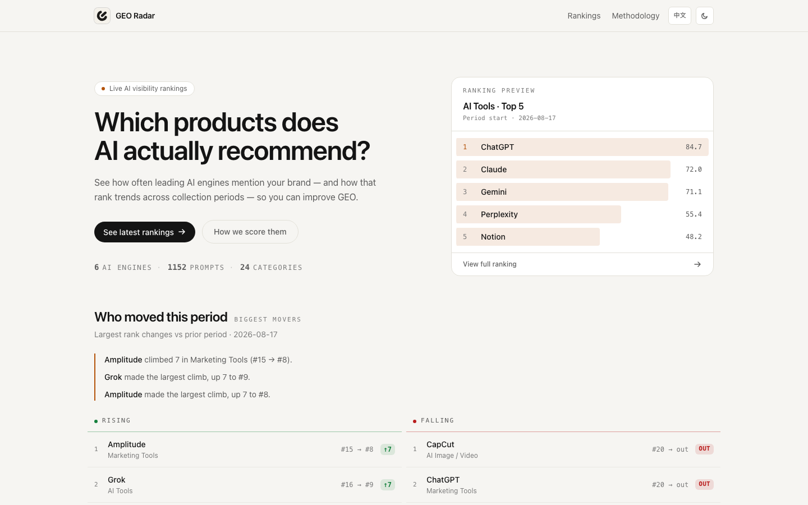

# GEO Radar

Track which products are recommended by ChatGPT, Gemini, and Grok.

GEO Radar measures AI visibility by analyzing AI-generated answers and producing weekly rankings across categories.



Built for teams working on AI Visibility and Generative Engine Optimization (GEO).

## Why GEO Radar

AI assistants are becoming the new recommendation layer.

Instead of browsing ten blue links, users increasingly ask ChatGPT, Gemini, and Grok for product recommendations. GEO Radar tracks which brands appear most often in those answers and turns AI recommendations into measurable visibility rankings.

## Features

- Weekly AI Visibility Rankings
- ChatGPT / Gemini / Grok coverage
- AI Tools rankings
- SaaS rankings
- Marketing rankings
- Developer Tools rankings
- Transparent scoring methodology
- Historical ranking snapshots

## Live Site

**https://georadar.website**

## Example Rankings

- [AI Tools Visibility Rankings](https://georadar.website/category/ai-tools)
- [SaaS Visibility Rankings](https://georadar.website/category/saas-software)
- [Marketing Tools Visibility Rankings](https://georadar.website/category/marketing-tools)
- [Developer Tools Visibility Rankings](https://georadar.website/category/developer-tools)
- [AI Image & Video Visibility Rankings](https://georadar.website/category/ai-image-video-tools)

## How It Works

1. Query ChatGPT, Gemini, and Grok with category-specific prompts
2. Extract and normalize brand mentions
3. Aggregate visibility signals
4. Calculate weekly visibility scores
5. Publish leaderboard snapshots

The ranking pipeline runs weekly and publishes static leaderboard snapshots.

## Tech Stack

- Next.js
- PostgreSQL
- Prisma
- OpenRouter
- Vercel Blob
- Tailwind CSS

## Documentation

| Document | Description |
|----------|-------------|
| [docs/prd/PRD-phase-1.md](./docs/prd/PRD-phase-1.md) | Implemented Phase 1 scope |
| [docs/architecture.md](./docs/architecture.md) | System architecture and data flow |
| [docs/setup.md](./docs/setup.md) | Environment, database, and deploy |
| [docs/operations.md](./docs/operations.md) | Pipeline, publish, cron, and operations |
| [docs/data-pipeline.md](./docs/data-pipeline.md) | Detailed pipeline design |
| [docs/review-queue.md](./docs/review-queue.md) | Review workflow |
| [docs/seo.md](./docs/seo.md) | Technical SEO and SEO backlog |
| [docs/prd/PRD-phase-2.md](./docs/prd/PRD-phase-2.md) | Current Phase 2 roadmap |
| [docs/prd/PRD-phase-next.md](./docs/prd/PRD-phase-next.md) | Future backlog |

## Quick Start

### Install

```bash
npm install
```

### Configure Environment

```bash
cp .env.example .env
```

Fill in the required variables (see [docs/setup.md](./docs/setup.md)).

### Database

```bash
npm run db:push
npm run seed
```

### Start

```bash
npm run dev
```

Visit [http://localhost:3000](http://localhost:3000)

## Commands

| Command | Purpose |
|---------|---------|
| `npm run dev` | Start development server |
| `npm run build` | Production build |
| `npm run pipeline` | Run weekly pipeline |
| `npm run publish` | Publish rankings to Blob |
| `npm run review:auto` | Preview auto review |
| `npm run review:export` | Export review queue |
| `npm run review:import` | Import review decisions |

## Weekly Update Flow

```bash
npm run pipeline
npm run review:auto -- --apply
```

After processing:

- Rankings are stored in PostgreSQL
- Snapshots are uploaded to Vercel Blob
- Frontend loads static leaderboard JSON

Details: [docs/operations.md](./docs/operations.md)

## SEO

Production checklist:

- Canonical URL configured
- robots.txt accessible
- sitemap.xml accessible
- Google Search Console verified
- Metadata configured
- Indexing requested

See [docs/seo.md](./docs/seo.md)

## License

MIT
