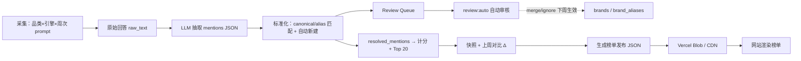

# PRD：GEO Radar

> 本文档只维护当前产品范围和实现状态。详细架构见 [architecture.md](./architecture.md)，具体运维步骤见 [operations.md](./operations.md)。

| 字段 | 内容 |
|------|------|
| 产品名 | **GEO Radar** |
| 仓库 | `geo-rank` |
| 版本 | 1.1 |
| 文档 | 中文 |
| 网站 / Prompt | 英文 |
| 技术栈 | Next.js |

---

## 1. 概述

公开落地页排行榜。每周用固定英文 prompt 询问 **ChatGPT / Gemini / Grok**，从回答中**动态提取**被推荐的产品/品牌，按可解释公式计分，每品类取 **Top 20** 发布。

**主文案：** *AI Visibility Rankings for products in AI answers.*  
**副标题：** *Track which products are recommended by ChatGPT, Gemini, and Grok.*

---

## 系统流程



---

## 2. MVP 范围

**引擎：** ChatGPT、Gemini、Grok

**第一阶段（MVP）— 5 品类：**

| 品类 | 说明 |
|------|------|
| AI Tools | |
| SaaS Software | |
| AI Image / Video Tools | |
| Developer Tools | |
| Marketing Tools | |

- 每品类每周动态产出 Top 20
- 每周一凌晨自动跑采集 + 计分，当天发布
- 数据标注为 `Week of YYYY-MM-DD`（周一日期）
- 品类总榜 + 三模型分榜（ChatGPT / Gemini / Grok）
- 对比上周名次（首周显示 **New**，上周未进榜显示 **Not ranked last week**）
- 同一品牌可同时出现在多个品类榜单
- 方法论页（英文，注明通过官方 API 采集）
- 用户：大众

**榜单规则：**
- 名单**不预先固定**；每周从该品类 prompt 的回答里提取、计分、取前 20
- UI 展示**规范名**（如 `ChatGPT`，不写 `GPT-4o`）
- 后台**别名表**用于合并同一品牌；未匹配品牌**自动新建**并参与本周计分，同时进入 **Review Queue**；通过 `review:auto` 自动 merge/new/ignore，或人工编辑后 `review:import`
- 各品类独立发现、独立 Top 20

---

## 3. 计分

**指标**

| 指标 | 定义 |
|------|------|
| Appearance Rate | 有效回答中被提及的比例 |
| Average Rank | 被提及时在该回答中相对所有被提取品牌的首次出现位次（1 = 最先） |
| Model Coverage | 当周有提及的引擎数 / 3（ChatGPT、Gemini、Grok） |

**有效回答：** API 成功、正文非空、非完全拒绝。

**总榜分数（0–100）**

```
Score = 0.50 × AppearanceRate + 0.40 × AvgRankScore + 0.10 × ModelCoverage
```

- `AppearanceRate` → ×100
- `AvgRankScore` → 指数衰减：`100 × e^(-0.15 × (avgRank - 1))`，零提及 = 0
- `ModelCoverage` → `(引擎数 / 3) × 100`

**模型分榜：**

```
EngineScore = 0.55 × AppearanceRate + 0.45 × AvgRankScore
```

**入榜：** 当周**已匹配**品牌计分后，按 Score 取 Top 20。

**并列：** Score → Appearance Rate → Average Rank → 字母序。

**提取与合并：** 对每条原始回答抽取 `mentions(raw_brand, position)`；先走规范名/别名精确匹配；未匹配则自动创建 `brands` 记录并参与本周计分，同时写入 Review Queue；人工 merge 后从下周起别名生效。

**冷启动（第一周 brands 表为空）：** 采用自动新建策略——所有提取品牌均自动创建并计分，无需预置种子名单；首周可能出现重复名（如 Jasper / Jasper AI），通过 Review Queue 合并后下周生效。

---

## 4. 上周对比

| 情况 | 展示 |
|------|------|
| 本周在榜，上周也在榜 | ↑2 / ↓1 |
| 本周在榜，上周不在 Top 20 | **Not ranked last week** |
| 本周在榜，上周该品类无数据（首周） | **New** |

---

## 5. Prompt 集

每品类 8 条，不含品牌名，版本号 `prompt_set_id`。

### AI Tools
1. What are the best AI tools for everyday productivity in 2026?
2. Recommend top general-purpose AI assistants people should try.
3. Which AI tools are most useful for research and summarizing information?
4. What AI products would you recommend for beginners getting started with generative AI?
5. List the leading AI tools used by startups and knowledge workers.
6. What are the most popular AI chat and copilot products right now?
7. Which AI tools are best for brainstorming and content ideation?
8. Recommend well-known AI platforms that integrate into daily workflows.

### SaaS Software
1. What are the best SaaS tools for running a modern small business?
2. Recommend popular software-as-a-service products used by startups.
3. Which SaaS platforms are essential for team collaboration and operations?
4. What SaaS tools would you recommend for sales and customer success teams?
5. List widely used SaaS products for finance and subscription businesses.
6. What are the top SaaS tools for product and project teams?
7. Which cloud software products dominate the B2B SaaS landscape?
8. Recommend mainstream SaaS apps that companies commonly subscribe to.

### AI Image / Video Tools
1. What are the best AI image generation tools in 2026?
2. Recommend top AI video generation and editing products.
3. Which AI tools are best for creating marketing visuals and thumbnails?
4. What AI image or video products are most popular with creators?
5. List leading generative AI tools for photos, illustrations, and short video.
6. Which AI products would you recommend for text-to-image workflows?
7. What are the best AI tools for text-to-video or avatar videos?
8. Recommend well-known AI creative tools for visual content production.

### Developer Tools
1. What are the best developer tools and platforms for software teams in 2026?
2. Recommend popular tools developers use for coding, review, and shipping software.
3. Which developer productivity tools are most widely adopted?
4. What tools would you recommend for cloud-native application development?
5. List leading platforms for source control, CI/CD, and DevOps.
6. Which AI coding assistants are most recommended for developers?
7. What are the top tools for API development and testing?
8. Recommend mainstream developer tools used by professional engineering teams.

### Marketing Tools
1. What are the best marketing tools for digital marketers in 2026?
2. Recommend popular platforms for email, SEO, and campaign management.
3. Which marketing SaaS tools are essential for growth teams?
4. What tools would you recommend for social media marketing and scheduling?
5. List leading products for marketing analytics and attribution.
6. Which tools are best for content marketing and CMS-driven campaigns?
7. What are the top advertising and marketing automation platforms?
8. Recommend well-known marketing tools used by modern marketing teams.

---

## 6. 页面

| 模块 | 内容 |
|------|------|
| Home | 品牌 + 主文案 + 进入榜单 |
| Category board | 品类动态 Top 20（综合分） |
| Engine board | 同品类单引擎分榜（ChatGPT / Gemini / Grok） |
| Last week | 名次变化 / Not ranked last week / New |
| Why recommends | 品牌高频被 AI 推荐的理由聚合 |
| Methodology | 公式、引擎、动态入榜规则、更新频率、API 采集说明 |

**表格列：** Rank、Brand、Score、Appearance Rate、Avg Rank、Model Coverage（总榜）、Δ vs last week

---

## 7. 技术

- Next.js + Postgres + Prisma + Vercel Blob + 周更 Cron（每周一凌晨，`/api/cron`）
- 通过 **OpenRouter** 统一 API 采集：ChatGPT (`openai/gpt-4o`)、Gemini (`google/gemini-2.5-flash`)、Grok (`x-ai/grok-4.5`)
- 抽取：GPT-4o mini (`openai/gpt-4o-mini`，temperature=0 + JSON mode），同样走 OpenRouter；超过 30 条 mentions 自动截断
- 标准化：规范名/别名精确匹配 → `resolved_mentions`；未匹配自动新建品牌
- Review Queue：`review:auto` 规则自动审核（可选 LLM），或 `review:export` / `review:import` 人工处理
- merge/ignore 从下周 pipeline 起生效，不重算当周快照
- 某引擎有效回答 < 80% 时不发布该引擎分榜；三引擎均达标才发布总榜
- PostgreSQL 负责后台计算和历史数据；周更完成后生成静态榜单 JSON 上传到 Vercel Blob，前台不在用户请求时直接查询数据库

**环境变量：** `DATABASE_URL`、`OPENROUTER_API_KEY`、`PIPELINE_SECRET`、`CRON_SECRET`

**核心命令：**

```bash
npm run pipeline                          # 周更管道
npm run review:auto -- --apply            # 自动审核（推荐）
npm run review:export && npm run review:import  # 人工审核（备选）
```

详见 [data-pipeline.md](./data-pipeline.md)、[review-queue.md](./review-queue.md)。

---

## 8. 实现状态（MVP）

- [x] 5 品类 × 3 引擎采集与计分
- [x] 前端首页 / 品类榜 / 模型分榜 / 方法论页
- [x] Review Queue 自动化审核（`review:auto`）
- [x] 首周数据已跑通（`Week of 2026-07-27`）

---

> 第二阶段规划已拆分到 [PRD-phase-2.md](./PRD-phase-2.md)。
