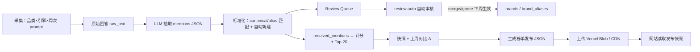

# GEO Radar 数据管道（MVP）

> 本文档记录 pipeline 的详细实现和数据模型。整体系统边界与组件职责以 [architecture.md](./architecture.md) 为准，操作命令以 [operations.md](../ops/operations.md) 为准。

## 1. 总目标
把「非结构化 AI 回答」转成「可计分的品牌提及记录」，最终生成每周快照榜单（Top 20）。

核心链路：
`AI 回答 → 抽取 mentions → 规范化 brand_id → 计分 → 取 Top 20 → PostgreSQL 快照 → 发布 JSON → 网站渲染`

PostgreSQL 是后台计算和历史数据源；Vercel Blob 中的 JSON 是前台发布产物。用户访问榜单时不直接查询远程 PostgreSQL，只有每周 pipeline 发布时访问数据库。

## 2. 系统流程图



## 3. MVP 范围

**引擎：** ChatGPT、Gemini、Grok

第一阶段 5 品类：AI Tools、SaaS Software、AI Image / Video Tools、Developer Tools、Marketing Tools

每品类 8 条 prompt × 3 引擎 = 24 次采集/品类/周，共 120 次/周。

## 4. 数据模型

### 4.1 Prompt 表
- `prompts`
  - `id`
  - `category`
  - `prompt_text`
  - `version`
  - `active`（boolean）
  - `created_at`

### 4.2 原始回答
- `responses`
  - `id`
  - `week`（`Week of YYYY-MM-DD`，周一日期）
  - `category`
  - `engine`（chatgpt/gemini/grok）
  - `model_slug`（OpenRouter 模型标识，如 `openai/gpt-4o`）
  - `prompt_id`
  - `raw_text`
  - `status`（ok/failed）
  - `token_cost`（本次调用 token 费用，用于成本分析）

### 4.3 抽取结果
- `extracted_mentions`
  - `id`
  - `response_id`
  - `raw_brand`
  - `position`（该回答内的推荐顺序，1 开始）

### 4.4 品牌主表与别名表
- `brands`
  - `id`
- `canonical_name`（UI 展示名）
- `entity_type`（product/company/platform/feature/model/unknown）
- `entity_type_source`（rule/manual/llm；人工或 LLM 决策不会被规则覆盖）
- `parent_brand_id`（可选，母公司关系，不用于合并产品）
- `ranking_enabled`（是否参与 Top 20）
  - `created_at`

- `brand_aliases`
  - `id`
  - `brand_id`
  - `alias`
  - `source`（manual/review_queue/seed）
  - `created_at`

### 4.5 审核队列
- `brand_review_queue`
  - `id`
  - `raw_brand`
  - `count`（本周出现次数）
  - `week`
  - `sample_response_id`
  - `possible_brand_id`（可选）
  - `status`（pending/merged/new/ignored）

### 4.6 忽略词表
- `ignored_terms`
  - `id`
  - `term`
  - `created_at`

### 4.7 标准化后的提及
- `resolved_mentions`
  - `id`
  - `response_id`
  - `brand_id`
  - `position`
  - `match_type`（canonical/alias/auto_new/reviewed）
  - `raw_brand`

### 4.8 发布快照
- `snapshots`
  - `week`（`Week of YYYY-MM-DD`，周一日期）
  - `category`
  - `engine`（nullable = 总榜）
  - `brand_id`
  - `score`
  - `appearance_rate`
  - `avg_rank`
- `model_coverage`（总榜才有）
- `rank`

### 4.9 前台发布文件

每周计分完成后，为每个品类生成一个 JSON 文件，并上传到 Vercel Blob：

```text
leaderboards/
  2026-07-27/
    ai-tools.json
    saas-software.json
    ai-image-video-tools.json
    developer-tools.json
    marketing-tools.json
    manifest.json
  latest/
    manifest.json
```

每个品类 JSON 同时包含 Overall、ChatGPT、Gemini、Grok 四份榜单及上周排名信息。前端首次进入品类时读取一个发布文件，Tab 切换只在客户端完成。

### 4.10 Pipeline 运行记录

每次 pipeline 执行都会在 `pipeline_runs` 创建一条记录。即使同一周重复执行，也保留独立运行记录，便于区分 Cron、手动重跑和失败重试。

| 字段 | 说明 |
|------|------|
| `week` | 目标周次 |
| `status` | `running` / `success` / `failed` |
| `current_step` | 当前步骤：collecting、extracting、normalizing、classifying、scoring、publishing |
| `started_at` / `finished_at` | 开始与结束时间 |
| `*_count` | 各步骤处理数量 |
| `snapshot_count` | 该周生成的快照数量 |
| `manifest_url` | 发布成功后的榜单 manifest 地址 |
| `error_message` | 失败时的错误信息 |

检查最近运行结果：

```sql
SELECT id, week, status, current_step, started_at, finished_at,
       collected_count, extracted_count, resolved_count,
       snapshot_count, manifest_url, error_message
FROM pipeline_runs
ORDER BY started_at DESC
LIMIT 10;
```

判断本周是否成功，应同时确认：`pipeline_runs.status = 'success'`、`snapshot_count > 0`，以及 `manifest_url` 已写入（生产环境）。

## 5. 采集（Collector）
对每个 `category × engine × prompt_id`：
1. 通过 **OpenRouter** 统一调用：ChatGPT (`openai/gpt-4o`)、Gemini (`google/gemini-2.5-flash`)、Grok (`x-ai/grok-4.5`)
2. 保存 `responses(raw_text + 元数据)`
3. 失败/拒答按 `status=failed` 记录

发布阈值：
- 某引擎有效回答率 < 80%：不发布该引擎分榜
- 三引擎均达标：发布总榜

## 6. 抽取（LLM Extraction）
输入：`responses.raw_text`
输出：mentions JSON
抽取模型：GPT-4o mini (`openai/gpt-4o-mini`，temperature=0 + JSON mode），同样走 OpenRouter，与采集引擎分开

### 6.1 JSON Schema
```json
{
  "mentions": [
    { "raw_brand": "Jasper", "position": 1 }
  ]
}
```

约束：
- `position` 为该回答内的推荐顺序（1 开始）
- 不输出引擎自身名（例如在 ChatGPT 采集时不把 "ChatGPT" 当品牌）
- 只提取产品/品牌名，不提取泛词
- 每条回答最多提取 30 个；超出时**自动截断前 30 条**并继续入库（不中断管道）

### 6.2 落库
为每个 `response_id` 写入 `extracted_mentions`

## 7. 标准化（Brand Normalization）

对每条 `extracted_mentions.raw_brand`：
1. 预处理：小写、去首尾空格、去常见后缀（`.ai`、`.com`、`Inc.`）
2. 检查 `ignored_terms`，命中则跳过
3. exact 匹配 `brands.canonical_name`
4. exact 匹配 `brand_aliases.alias`（所有匹配统一使用 `normalizeBrandKey`）
5. 未匹配 → **自动创建** `brands` 记录（`canonical_name` = 规范化后的 raw_brand），写入 `resolved_mentions` 参与本周计分，同时写入 `brand_review_queue`（`status=pending`）

### 7.1 冷启动
第一周 `brands` 表为空时，所有提取品牌走步骤 5 自动新建，首周即可出榜。首周可能有重复名（Jasper / Jasper AI），人工 merge 后别名从下周生效。

## 8. Review Queue 确认流程

> 操作步骤详见 [review-queue.md](../ops/review-queue.md)。

### 8.1 触发
每周标准化时，未匹配品牌自动新建并计分，同时进入 `brand_review_queue`（`status=pending`）。

**merge/ignore 从下周 pipeline 起生效**；自动新建的品牌当周即参与计分。

### 8.2 推荐路径：自动审核

```bash
npm run review:auto              # 预览决策 → data/review-auto.json
npm run review:auto -- --apply   # 应用高置信度结果
```

自动化策略：泛词 ignore → 已知别名/相似度 merge → 其余 new；可选 `--llm` 辅助。

### 8.3 备选路径：人工审核

```bash
npm run review:export   # → data/review.json
# 编辑 action: merge / new / ignore
npm run review:import
```

`data/` 为运行时临时目录（gitignore），入库后可删除。

### 8.4 操作含义

| 操作 | 含义 | 系统动作 |
|------|------|----------|
| `merge` | 已有品牌的别名 | 写入 `brand_aliases`，从下周起合并 |
| `new` | 确认保留为独立品牌 | 标记 reviewed |
| `ignore` | 非产品/噪音 | 写入 `ignored_terms`，从下周起过滤 |

### 8.5 预期工作量

- 首周：候选多（可全量 `review:auto --apply`）
- 稳定后：每周 < 10 条 pending，`review:auto` 可自动清零

## 9. 计分与 Top 20

计分只包含 `entity_type = product` 且 `ranking_enabled = true` 的品牌。
公司、平台、功能和模型仍保留在 `resolved_mentions` 中，供后续 visibility 分析，
不会因为共享母公司而合并。

**总榜分数（0–100）**

```
Score = 0.50 × AppearanceRate + 0.40 × AvgRankScore + 0.10 × ModelCoverage
```

- `AppearanceRate` → ×100
- `AvgRankScore` → 指数衰减：`100 × e^(-0.15 × (avgRank - 1))`，零提及 = 0
- `ModelCoverage` → `(引擎数 / 3) × 100`（ChatGPT、Gemini、Grok）

**模型分榜：**

```
EngineScore = 0.55 × AppearanceRate + 0.45 × AvgRankScore
```

入榜：当周全部已匹配品牌计分后，按 Score 取 Top 20。

并列：Score → Appearance Rate → Average Rank → 字母序。

## 10. 上周对比（Δ）
对同一 `category + engine + brand_id`：
- 本周在榜 && 上周也在榜 → rank 差（↑2 / ↓1）
- 本周在榜 && 上周不在 Top 20 → `Not ranked last week`
- 首周（上周无数据） → `New`

## 11. 命令与环境变量

### 环境变量

| 变量 | 用途 |
|------|------|
| `DATABASE_URL` | PostgreSQL 连接串 |
| `OPENROUTER_API_KEY` | OpenRouter API（采集 + 抽取） |
| `PIPELINE_SECRET` | `/api/pipeline` 鉴权 |
| `CRON_SECRET` | `/api/cron` 鉴权 |
| `BLOB_READ_WRITE_TOKEN` | Vercel Blob 写入 Token |
| `LEADERBOARD_MANIFEST_URL` | `latest/manifest.json` 的公开 URL |

### 命令

| 命令 | 说明 |
|------|------|
| `npm run seed` | 导入 40 条 prompt |
| `npm run pipeline` | 完整周更管道 |
| `npm run review:auto` | 预览自动审核 |
| `npm run review:auto -- --apply` | 应用自动审核 |
| `npm run review:export` | 导出待确认列表 |
| `npm run review:import` | 导入人工标注 |
| `npm run publish -- "Week of YYYY-MM-DD"` | 生成并上传指定周榜单快照 |

### 周更编排

```
每周一 Cron → /api/cron → pipeline（采集、抽取、标准化、分类、计分、发布 JSON）
pipeline 完成后 → review:auto --apply
```

本地等价：

```bash
npm run pipeline
npm run review:auto -- --apply
```

### 11.1 发布与回退策略

- 配置 `BLOB_READ_WRITE_TOKEN` 后，pipeline 自动上传榜单 JSON。
- 页面配置 `LEADERBOARD_MANIFEST_URL` 后，优先读取 Blob 发布数据。
- 未配置发布地址时，页面回退到带缓存的 PostgreSQL 查询，便于本地开发。
- 发布文件只在每周更新，用户请求不会触发采集或计分。

## 12. 历史数据重处理

当 canonical 规则或实体规则发生变化时，可指定周次重处理：

```bash
npm run reprocess -- --week "Week of 2026-07-27"
```

该命令会合并历史品牌、更新 `resolved_mentions`、重新分类实体并强制重算该周快照。
它会修改历史归一化结果，不应在没有确认目标周次的情况下用于生产数据。
