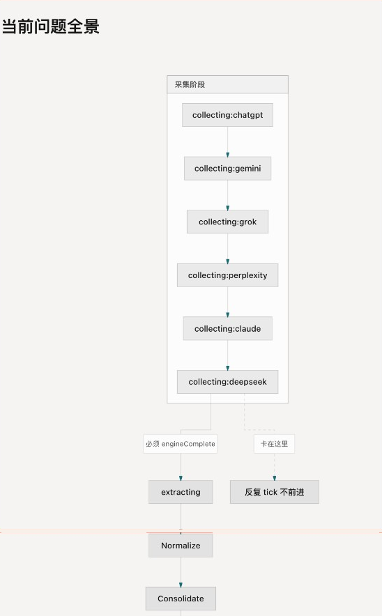

# 2026-08-03 周更 Pipeline 事故分析

**状态：已恢复**  
**影响周次：** `Week of 2026-08-03`  
**影响时间（北京时间）：** 10:04–18:17  
**严重度：** SEV-2（本周榜单未能按计划完成发布；站点在恢复前继续展示上一周数据）

## 摘要

2026-08-03（周一）的自动周更未能在首次运行中完成。采集任务长时间停留在 `collecting`，没有及时失败；后续重试又先后遇到一次数据库连接中断，以及规范化阶段超过 20 分钟超时。最终在优化规范化逻辑后，Pipeline 于 17:24 完成计算，生成 400 条快照。

计算完成后，发布产物仍未立即让前台更新：同周 Blob 文件不可覆盖、`latest/manifest.json` 写入失败被吞掉，且旧的 `latest` 文件有 30 天 CDN 缓存。修复覆盖写入、失败传播与缓存策略后，于 18:17 幂等重发既有快照；`latest` 和前台品类页均已切换到本周。

没有重新采集已完成的数据；最后的发布恢复不调用 OpenRouter，不产生新的 AI 请求费用。

## 用户影响

- 周一的榜单未按预期自动更新。
- 恢复前，依赖 `leaderboards/latest/manifest.json` 的前台会继续读取 `Week of 2026-07-27`。
- 数据库中本周最终数据完整：120 个成功回答、2,465 个已抽取提及、400 条排行榜快照。
- 未发现已发布周快照被覆盖为错误数据或数据丢失。

## 事实时间线（北京时间）

| 时间 | 事件 | 结果 |
| --- | --- | --- |
| 10:04 | 自动 Pipeline 开始，运行 `cmscl66r9000004jubr5ei0ar` | 停留在 `collecting`。 |
| 16:09 | 可靠性恢复时将该运行标记为失败 | 运行已超过预期采集窗口，未产生可用计数。 |
| 16:27 | 第一次人工重试，运行 `cmscyuqc80000mjkkfxwcifww` | 16:34 因 `Connection terminated unexpectedly` 失败。 |
| 16:34 | 第二次重试，运行 `cmscz48lv0000d9kksx01l5ca` | 采集完成 120 个回答、抽取 2,465 条提及；17:11 在规范化阶段超过 20 分钟超时。 |
| 17:15 | 第三次重试，运行 `cmsd0kpfa0000tbkknr54bj7g` | 17:24 成功完成：规范化 801、快照 400。已完成的回答与提及被复用。 |
| 17:24 后 | 发现本周 immutable manifest 已存在，但 `latest` 仍指向旧周 | 发布端未正确覆盖既有 Blob，且失败被静默处理。 |
| 18:17 | 部署发布修复后，幂等重发本周快照 | `latest`、本周 manifest、前台 AI Tools 页均确认显示 `Week of 2026-08-03`。 |

> 时间来自 `pipeline_runs.started_at` / `finished_at`（UTC 转北京时间）和 Blob manifest 的 `publishedAt`。发布接口的具体调用时间未单独持久化，使用 manifest 时间作为完成时间。

## 根因分析

### 1. 首次采集没有完整的超时边界（主因）

单个 OpenRouter 请求和整个采集阶段原先都缺少可靠的截止时间控制。外部请求未返回时，运行会一直保留 `running / collecting` 状态，直到人工介入；因此首次运行持续约 6 小时而没有自行失败或释放重试机会。

### 2. 规范化实现存在 N+1 数据库操作（主因）

规范化会对大量 mention 逐条查询并写入数据库。本周有 2,465 条提及，逐条读写使该阶段在 20 分钟 watchdog 内无法完成。这个超时是保护机制正确生效，而不是数据本身异常。

### 3. 发布缺少"提交点"语义（主因）

发布本周文件成功并不等于站点已经切换。本周文件写入后：

- 既有路径默认不允许覆盖，重发同一周失败；
- `latest/manifest.json` 的写入异常被捕获后忽略；
- `latest` 使用默认 30 天缓存，属于可变指针却被当成不可变文件缓存。

因此接口可表现为成功或周 manifest 可用，但前台仍是上一周。

### 4. 数据库连接中断（已知现象，根因待补证）

第一次人工重试记录的错误是 `Connection terminated unexpectedly`。现有 `pipeline_runs` 没有连接池、数据库端或请求链路的细粒度日志，无法严谨归因于连接池、网络或服务端重启；本报告不把它定为本次事故的根因。后续需要补充结构化错误上下文后再判断。

## 修复措施与验证

| 项目 | 已实施修复 | 验证结果 |
| --- | --- | --- |
| 外部请求 | 单次 OpenRouter 请求默认 45 秒超时，最多重试 1 次。 | 卡住的请求可失败返回，不再无限等待。 |
| Pipeline 阶段 | 采集、抽取及其他阶段设置 deadline/watchdog；超过 30 小时的 `running` 运行自动标为 stale/failed。 | 超时不会推进发布，也不会永久阻止后续运行。 |
| 采集恢复 | 并发上限设为 4；成功回答跳过，失败回答允许在重试时覆盖。 | 重试可复用已完成工作，避免重复请求。 |
| 规范化 | 预加载已有解析结果，批量写入新增记录，替换逐 mention 的多次数据库读写。 | 最终运行在约 9 分钟内完成整条 Pipeline。 |
| 周快照重发 | 同周 category JSON 与 week manifest 支持受控覆盖。 | 不重新采集即可安全重发已验证周。 |
| `latest` 提交点 | `latest/manifest.json` 支持覆盖、缓存设为 60 秒；写入失败会使发布失败。 | 最新 manifest 已指向 `Week of 2026-08-03`。 |
| 前台读取 | 当环境变量配置为 `latest` 路径时，前台按当前周读取不可变周 manifest。 | `/category/ai-tools` 已显示 `Week of 2026-08-03`。 |

相关提交：`0efd1b9 Improve pipeline reliability and leaderboard publishing`。

## 验收证据

- 成功运行：`cmsd0kpfa0000tbkknr54bj7g`
- 成功计数：120 successful responses、2,465 extracted mentions（前一失败运行已完成，最终续跑复用）、801 resolved mentions、400 snapshots。
- 本周 manifest：`leaderboards/Week of 2026-08-03/manifest.json`
- latest manifest：`leaderboards/latest/manifest.json`，内容周次为 `Week of 2026-08-03`。
- 生产页面：`https://georadar.website/category/ai-tools` 已确认显示本周周次。

## 后续预防动作

### 下次周更前完成

1. 已加入发布 manifest fixture：有效、旧周、缺榜单三种状态可通过 `npm run pipeline:fixtures` 本地验证。阶段超时和外部请求重试仍需在 staging 使用受控 fixture 演练。
2. 已加入 `/api/pipeline`、`/api/publish` 的结构化运行日志：run ID、阶段、耗时、Blob 写入结果与错误类型。
3. 已加入 Cron 后自动健康检查：确认运行成功、`snapshot_count > 0`、immutable week manifest 和 latest manifest 都已验证；生产环境会额外读取公开品类页确认实际渲染的周次；配置 Resend 后直发失败邮件，webhook 可作为备用通道。

### 后续迭代

1. 为数据库连接中断记录连接/请求上下文，并评估 Prisma/数据库连接池配置。
2. 将发布状态持久化为可查询的"周文件完成 + latest 已切换"两阶段状态，避免只看 Pipeline `success` 判断站点已更新。
3. 已实现发布后前台冒烟检查，确认 AI Tools 品类页读取的周次正确；首页检查可在首页展示周次后复用同一机制。

## 经验与边界

- "计算完成"与"站点已发布"是两个独立结果，必须分别验收。
- 对外部 API、数据库批处理和 Blob 发布都需要超时、幂等与可观测性；只靠人工观察运行状态不足以保证周更。
- 重发已验证快照属于发布恢复，不应重新执行采集；它不产生新的 OpenRouter 请求费用。
- 本次无法从现有日志精确拆分每次失败重试所产生的 OpenRouter 用量。未来应在每次运行中记录请求数、重试数和 provider request ID，才能做费用级别的归因。

---

# 2026-08-10 周更卡住（collecting）

**状态：** 本周核心 5 品类已人工续跑恢复；结构性防再发见下方。  
**影响周次：** `Week of 2026-08-10`  
**现象：** Cron 启动后 `pipeline_runs` 长期 `running` / `collecting`（约 26h+），本周 snapshots=0；前台当前周空榜。

## 根因（与 2026-08-03 同类）

1. **`/api/cron` 一次跑完全部 pipeline**，超过 Vercel serverless 执行上限时进程被杀死，**来不及把 run 标成 `failed`**。  
2. 陈旧判定原先看 `started_at`、默认 **30 小时**，卡住期间无法重入。  
3. Blob store blocked 是并行问题；空榜主因是本周未完成计分（DB-first 部署后仍需有 snapshots）。

## 恢复（已做）

- 人工标记卡住 run 失败。  
- 仅核心 5 品类补采（跳过已 ok 的 chatgpt/gemini），再 extract → score；`publish` 默认不写 Blob。  
- 生产 `/category/ai-tools` 恢复显示 `Week of 2026-08-10`。

## 防再发（代码）

- `runPipelineTick`：每次 Cron 只推进一个引擎或一个后处理阶段。  
- Cron `after()` 自链 + `vercel.json` 周一错峰多次触发。  
- `pipeline_runs.updated_at` 心跳；无心跳默认 **90 分钟** 标 stale。  
- `maxDuration = 300`。  
- 本地 `npm run pipeline` 仍为一键全量。

详见 [operations.md](../ops/operations.md)。

---

# 2026-08-18 Pipeline 采集稳定性修复

**状态：** 已实施  
**影响周次：** `Week of 2026-08-17`（deepseek 卡在 collecting，pipeline 无法推进至 extract/score/publish）  
**现象：** run 长期停在 `collecting:deepseek`，其余 5 个引擎早已完成，前台无法发布本周榜单。

## 根因（与前两次同类，但更深层）

1. **引擎串行 + 必须全部完成才推进**：6 个引擎严格串行，最后一个引擎（deepseek）必须 `engineComplete=true` 才能进入 `extracting`。deepseek 长尾慢时，整条 pipeline 死等。
2. **心跳只在 category 级别更新**：deepseek 卡在某个 category 中间时，`pipeline_runs.updated_at` 不动 → 90 分钟无心跳 → stale 判定 → run 被标 failed → 新 run 从头重建，浪费大量 tick。
3. **采集并发默认 1**：每次只打一个 OpenRouter 请求，deepseek 某 prompt 卡 60 秒就能吃掉整段 240s tick 预算。
4. **failed prompt 无重试上限**：结构性失败的 prompt 每次 tick 都重试，永远不会 ok，永远阻止 `engineComplete=true`。
5. **stale 重启从第一个引擎重头来**：即使 chatgpt/gemini/grok 等已全部完成，新 run 仍从 `collecting:chatgpt` 开始空转多个 tick 才能到达 deepseek。

## 修复（已实施）

- **Fix 1（根因）**：tick 进入 collecting 分支时，**先**调 `hasSufficientCollectedForScoring()`；若每个 due category 已有 ≥ 3 个完整引擎，立即跳到 `extracting`，不再等 deepseek。
- **Fix 2**：prompt 完成（成功或失败）后触发 heartbeat 回调（10s 节流），防止卡在 category 中间时被误判 stale。
- **Fix 3**：采集并发默认值 `1 → 2`，单 tick deepseek 吞吐量翻倍。
- **Fix 4**：`collectOne()` 加入重试计数，达到 `MAX_CATEGORY_ENGINE_RETRIES`（=2）次 failed 后 skip，不再烧 API。
- **Fix 5**：新 run 创建时调 `findFirstIncompleteEngine()`，从真正未完成的引擎开始，跳过已完成引擎的空转 tick。
- **Fix 6**：`runFullPipeline()`（本地 `npm run pipeline`）同步应用门槛推进逻辑，不再死等 deepseek。

## 改动文件

- `src/pipeline/collect.ts`：Fix 2（prompt heartbeat 回调）、Fix 3（并发 1→2）、Fix 4（重试上限）
- `src/pipeline/run.ts`：Fix 1（tick 开头提前推进）、Fix 5（smart restart）、Fix 6（runFullPipeline）
