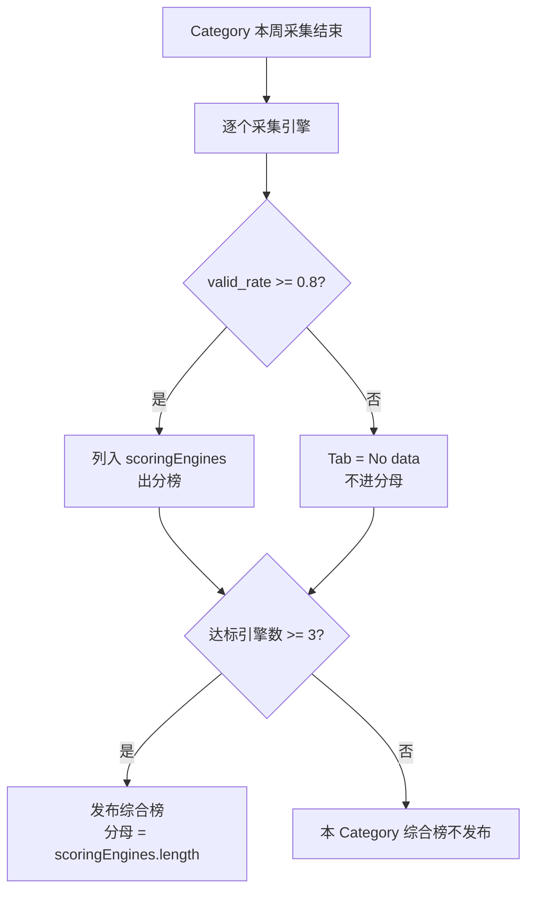
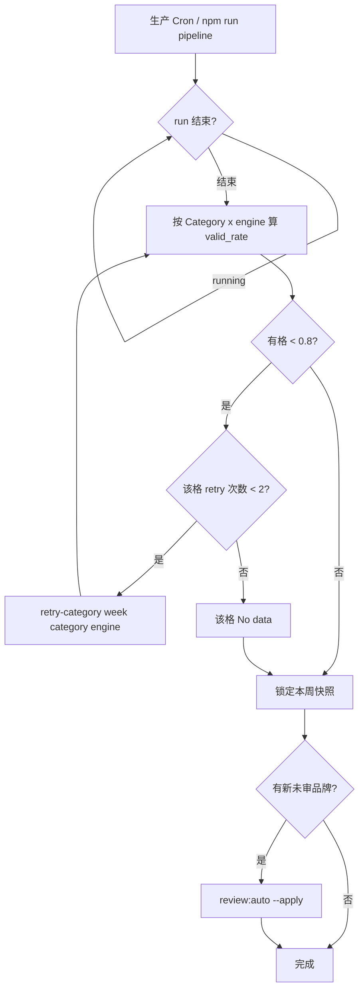
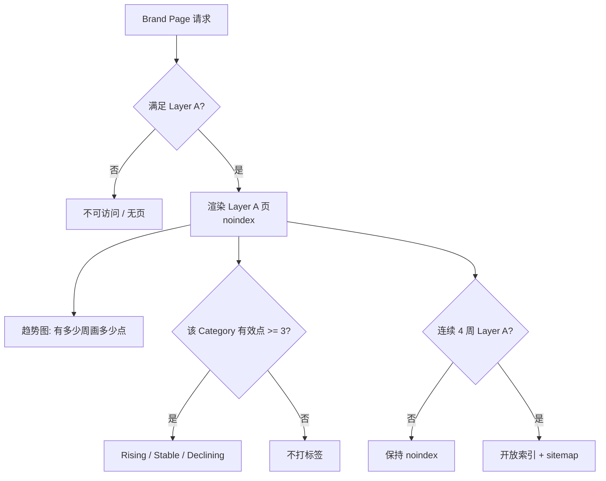
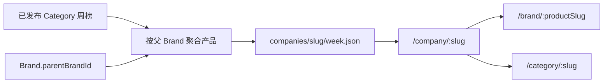

# Phase 3 技术文档

> 对应需求：[PRD-phase-3.md](./PRD-phase-3.md)。本文只写实现、门闩、数据契约与流程图。

## 1. 现网基线与风险

参考 [2026-08-03 周更事故](../../incidents/2026-08-03-weekly-pipeline-incident.md)：

- 3 引擎全流程约 9 分钟
- 采集并发 4；单次 OpenRouter 45s 超时、失败重试 1 次
- 各 stage watchdog 20 分钟（`PIPELINE_COLLECTION_TIMEOUT_MS` 等，见 `src/lib/pipeline-timeouts.ts`）
- 现网 `score.ts`：`ENGINES.every` 全过 0.8 才出 overall；Model Coverage 分母 = `ENGINES.length`（写死）

3 → 6 引擎采集量约翻倍。staging 6 引擎全量采集若 ≥ watchdog 的 70%，先降并发或分批，不先调大超时。

## 2. 术语（实现）

| 术语 | 含义 |
|------|------|
| 采集引擎 | 本周发请求并入库。三个新引擎与旧引擎同一周进入采集集。 |
| 计分引擎 | **按 Category × 周**。该格有效回答率 ≥ 0.8 才进该 Category 综合榜与 Model Coverage。写入该 Category 快照 `scoringEngines[]`。 |
| 有效回答率 | `status=ok` 条数 / 该引擎该 Category 当周总请求。`ok` = API 成功且正文非空（`collect.ts`）。阈值 `VALID_RESPONSE_THRESHOLD = 0.8`。 |
| 当周达标即计分 | ≥ 0.8 本周就算。第一次挂了先重跑，再定 `No data`。 |

DeepSeek 可以 AI Tools 达标、SaaS 不达标。

## 3. 引擎接入

### 3.1 Provider 与 slug

复用 `ENGINE_MODEL_SLUGS` + 现有 OpenRouter client。某引擎走不通再抽 provider 层，禁止单独硬编码采集路径。

| 引擎 | 默认 slug | 禁区 |
|------|-----------|------|
| Perplexity | `perplexity/sonar`；干跑过薄再试 `perplexity/sonar-pro` | Deep Research |
| Claude | `anthropic/claude-sonnet-4.5` | Opus |
| DeepSeek | `deepseek/deepseek-v4-flash`；alias 不可用则用当时 V4 Flash 版本 slug | R1 |

配置拆开「本周采集哪些」和「本周允许计分哪些」。新引擎默认两者都进；是否真计分只看当周有效回答率。

接入前用历史 `response.tokenCost` 估月度成本，对照预算。

### 3.2 上线前置

进入生产 cron 前：

1. `npm run pipeline:fixtures`（或新引擎 fixture）跑通 collect → extract → normalize → score → publish
2. 用**生产 prompt 集**对活模型干跑一次 collect（staging 或非发布生产跑）。干跑不发布

### 3.3 发布门闩

取代 `ENGINES.every`：

- 单引擎分榜：该 Category 该引擎 ≥ 0.8 才出排行，否则 Tab = `No data`
- 综合榜：只用该 Category 最终达标的计分引擎
- 分母 = 该 Category 快照 `scoringEngines.length`（6 采 / 5 达标 → 5）
- 达标计分引擎 < 3 → 该 Category 综合榜不发布。注意：现网 `latest` 是整站指针，不是 per-category；实现时该品类本周不出综合榜或沿用上周该品类文件，不要虚构 per-category `latest`
- 未达标不阻断同 Category 其他引擎

公式变更递增 `scoringVersion`，不回写已冻结周。各计分引擎等权。



### 3.4 前台

- Tab / 引擎分项：按**采集引擎**渲染（含未达标 → `No data`）
- 综合榜 / Model Coverage / Brand Page 分数：只用该 Category `scoringEngines`
- 首页引擎数 = 本周至少一个 Category 达标的引擎并集
- 首页 prompt 数 = `采集引擎数 × 品类数 × 每品类 prompt 数`（3×5×8=120，6 引擎=240）
- 文案 “AI engines / AI models”；Tab 名仍是具体引擎
- 某 Category 本周 `scoringEngines` 比该 Category 上周增多：该 Category 页（Movers 若相关）出一句事实说明，只出扩展周

## 4. 同周重跑

### 4.1 规则

- 第一次 full pipeline 一结束立刻体检、立刻补洞
- 每个 **Category × engine** 每周：1 次 full pipeline + 最多 2 次 `retry-category`
- 每个 `week + engine + prompt` 最多 3 次真实请求；已 `ok` 不重打
- 2 次后仍 < 0.8 → `No data`，本周禁止再采；override 须人工显式
- 次数落库，`retry-category` 拦截第 3 次
- 命令必须带引擎：

```bash
npm run retry-category -- "Week of YYYY-MM-DD" "AI Tools" deepseek
```

禁止整品类 × 全引擎重跑。

脚本顺序（`src/scripts/retry-category.ts`）：

1. `collectCategory(category, week, undefined, engine)` — 只补该引擎 failed
2. `extractWeek` → normalize → consolidate → classify
3. `scoreCategory(..., { force: true })`
4. `publishLeaderboards(week, { updateLatest: true })`

不走 full pipeline 的 `running` 锁，但须等第一次 pipeline 结束。只在 full run 整段失败/几乎没产出时才重跑 `npm run pipeline`（Round 0，不计 2 次 retry）。

下一周 pipeline 启动后冻结上周。`No data` 格下周重新采，计数清零。retry 后若有新品牌，再跑 `review:auto -- --apply`。

### 4.2 流程



体检 SQL：

```sql
SELECT engine, category,
  COUNT(*) AS total,
  SUM(CASE WHEN status = 'ok' THEN 1 ELSE 0 END) AS ok,
  ROUND(1.0 * SUM(CASE WHEN status = 'ok' THEN 1 ELSE 0 END) / COUNT(*), 3) AS valid_rate
FROM responses
WHERE week = 'Week of YYYY-MM-DD'
GROUP BY engine, category
ORDER BY category, engine;
```

`valid_rate >= 0.8` 且 `total > 0` 达标。

例：DeepSeek / AI Tools = 0.625 → `retry-category … "AI Tools" deepseek`。到 0.875 进分母；两次仍 0.625 → 该格 `No data`，分母 5。

## 5. Brand Page

趋势图、标签、Similar Brands 的**口径**以 PRD 为准。实现要点：

- 趋势图只读已发布 Blob / 周快照，不在请求路径查 Postgres
- 标签按 Category 卡片计算，不写品牌总标签
- Similar Brands 纯规则，无 LLM
- Layer B 只改 `robots` / sitemap；趋势不绑 Layer B



## 6. 公司聚合

- 不新建 Company 表。公司 = `Brand.parentBrandId` 指向的父 Brand
- `/company/:slug` 的 slug = 父 Brand 稳定 slug（与 Brand Page 同一套规则）
- 公司实体若从未上榜，也要生成稳定 slug，不能只给上榜产品建 `brands/index.json`
- Blob：`companies/index.json`、`companies/{slug}/{week}.json`
- 从已发布周榜 + `parentBrandId` 派生，不二次采集
- 不写公司总分/排名



## 7. 线索表单

- Postgres `Lead`（或同等表）：`email`、`brandName`、`website`、`intent`、`message`、`consent`、`sourcePath`、`createdAt`
- honeypot + 每 IP 每小时最多 5 次
- 不接 CRM / 支付 / 账号；v1.3 不自动发信

## 8. 技术验收

- staging fixture 全链路无超时、无未捕获异常；生产 prompt 干跑完成且不发布
- 6 引擎采集耗时 < `PIPELINE_COLLECTION_TIMEOUT_MS` 的 70%，否则已改并发/分批
- `retry-category` 必须带引擎；每格最多 2 次且落库拦截；同周 `updateLatest: true`
- `scoringVersion` 已递增；冻结周未被回写
- 月度 token 成本预估已对照预算
- 公司页无独立 Company 表；Lead 写入成功/失败可见
