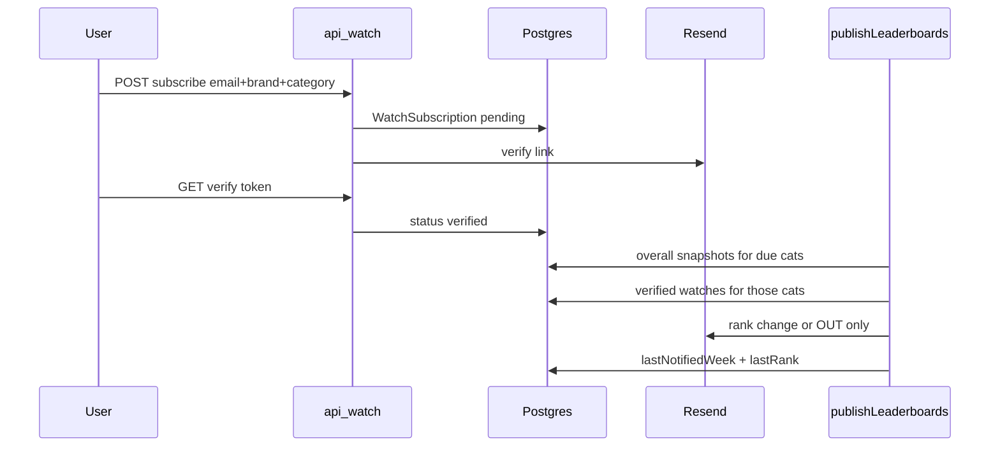

# Phase 6 技术文档

> 对应需求：[PRD-phase-6.md](./PRD-phase-6.md)（v1.6 · 定稿）。本文写实现计划、数据模型、触点与验收。产品契约只在 PRD。

## 1. 范围与状态

| 需求块 | 状态 | 主要触点 |
|--------|------|----------|
| P0 采集周期 | 已落地 | `category-period.ts`、`period.ts`、`period-sequence.ts`、collect / health / progress、`category-selection.md` |
| P1 Brand 官网 | 已落地 | `Brand.website`、`brand-websites.ts`、`seed:brand-websites`、Brand 页标题旁链接 |
| P2 Watch | 未落地（曾实现后撤回） | 下文 §2 |
| P3 建议新品类 | 未落地 | 下文 §3 |
| P4 周期发布提醒 | 未落地 | 依赖 P2 验证邮件 / 退订基建 |

全站：

- 对外 period / `YYYY-MM-DD`。
- 前台 SoT = DB `snapshots`。Overall 可读 = 该品类 Top20 已写入（≥3 引擎即可）。
- Watch / 发布提醒发信间隔跟品类采集天数（14 / 21），不承诺每周。

---

## 2. P2 · Watch 实现计划

### 2.1 锁定决策

- **发信**：复用已有 Resend（与 `pipeline-observability` 告警同模式）。`RESEND_API_KEY` + `WATCH_EMAIL_FROM`（如 `GEO Radar <noreply@…>`）。无 key 时订阅仍入库，验证链接打日志（本地可点），周期信跳过并记 `skip_no_mailer`。
- **整榜 Watch**：本阶段不做（PRD「可选后置」）。只做 **品牌 × 品类**。
- **`Lead` 表保留**：仅给验证成功后的轻量 `geo_audit` 二次入口用；Brand 主 CTA 不再走 `track_brand` 混表。

### 2.2 数据流



### 2.3 Schema

在 `prisma/schema.prisma` 新增：

```prisma
model WatchSubscription {
  id                String    @id @default(cuid())
  email             String
  brandId           String    @map("brand_id")
  category          String    // canonical category name
  status            String    // pending | verified | unsubscribed
  verifyToken       String    @unique @map("verify_token")
  unsubscribeToken  String    @unique @map("unsubscribe_token")
  verifiedAt        DateTime? @map("verified_at")
  unsubscribedAt    DateTime? @map("unsubscribed_at")
  lastNotifiedWeek  String?   @map("last_notified_week")
  lastRank          Int?      @map("last_rank") // null = was OUT / never ranked
  ipHash            String    @map("ip_hash")
  createdAt         DateTime  @default(now()) @map("created_at")
  brand             Brand     @relation(...)

  @@unique([email, brandId, category])
  @@index([status, category])
  @@index([ipHash, createdAt])
  @@map("watch_subscriptions")
}
```

`Brand` 增加 `watchSubscriptions WatchSubscription[]`。`db:push` 同步。

### 2.4 核心库

| 文件 | 职责 |
|------|------|
| `src/lib/mail.ts` | 薄封装 `sendMail({ to, subject, html, text })` → Resend；可抽自告警逻辑（告警可后续改用它） |
| `src/lib/watch.ts` | 校验订阅输入、token 生成、验重、状态机、组装验证/变更/退订邮件正文（英站主文案，中文 i18n 同步 CTA） |
| `src/lib/watch-notify.ts` | 给定 `week`：对本周有 overall 的品类，查 verified 订阅，比相邻发布点 rank，无变化 skip；发信后写 `lastNotifiedWeek` / `lastRank` |

**变化判定**：当前 overall rank vs `findPreviousPublishedPeriod` 上的 overall rank（无上一档则视为 new）。发信条件：rank 变了，或进/出 Top20（OUT = 当前无 overall ≤20）。**同一订阅同一 `week` 最多一封**（`lastNotifiedWeek === week` 则跳过）。

### 2.5 API / 路由

- `POST /api/watch` — body: `{ email, brandSlug, categorySlug, sourcePath?, companyUrl? }`；honeypot + 简易 rate limit（沿用 leads IP hash，盐 `WATCH_IP_SALT` 或复用 `LEAD_IP_SALT`）。已存在同 triple：pending 重发验证信；verified 返回已订阅；unsubscribed 重新 pending + 新 verify token。
- `GET /watch/verify?token=` — 置 `verified`，成功页 + **轻量 Audit CTA**（只邮箱/可选留言 → 现有 `/api/leads` `geo_audit`）。
- `GET /watch/unsubscribe?token=` — 置 `unsubscribed`，确认页。

### 2.6 UI

1. **Brand**：`WatchForm` 替换 `LeadForm` 在 `brand-page-content.tsx` 底部。
   - 只填邮箱；只读展示 `品牌名 × 锚定品类`。
   - 锚定品类：`backCategorySlug`（从 category `?from=`）若在本页 categories 里则用它，否则用 rank 最好的品类。
   - 提交成功：已发验证邮件 / 下期起通知。
2. **Category**：`CategoryBoard.tsx` Top20（及 Also mentioned）每行加「Watch」→ 同表单 modal（品类=本页，品牌=该行）。
3. i18n：`messages.ts` 增加 `watch.*`（中英）；Brand CTA 文案切到 Watch。

`LeadForm` 缩成仅 Audit 用，或 verify 成功页内联小表单；不再作为 Brand 主 CTA。

### 2.7 管道钩子

在 `publishLeaderboards` **DB overall 写完且本周发布路径成功/skipped（Blob 失败仍发）** 之后调用 `notifyWatchSubscriptions(week)`：

- 推荐：`notify` 入参用「本 `week` 下 `engine=null` 且 `rank≤20` 出现过的 category 集合」∩ 配置品类 —— 与「本 run 实际写出的榜」对齐。
- 失败发信只打 `logPipelineEvent`，不拖垮 publish。

### 2.8 Env / 文档

- `.env.example`：`WATCH_EMAIL_FROM`；注明共用 `RESEND_API_KEY`。
- PRD：勾 P2-1…P2-4；P2-5 / P2-6 留人工验收。

### 2.9 验收

1. Brand / Category 提交 → DB `pending` +（有 Resend）收到验证信。
2. 点验证 → `verified`；未验证不进 notify。
3. 模拟两档 rank 变化 → 一封变更信含旧/新名次或 OUT；无变化不发。
4. 退订后不再发。
5. Brand 主按钮无 website/message/intent 混表；Audit 仅验证成功后出现。

### 2.10 本块不做

- 整榜 Watch、账号体系、邮件粒度选项、P3/P4 本体。

---

## 3. P3 · 建议新品类实现计划

### 3.1 范围

按 PRD P3：

- `/rankings`：**搜索无结果** + **页脚/列表下方常驻**入口
- 表单：品类名必填；场景、邮箱、竞品可选
- 提交入库；成功文案写清「建议已收到、上线未定」
- **不做**：未发布卡片「上线时通知我」（PRD 后置，依赖邮件基建 / P4）

P2 Watch 本块不动。

### 3.2 Schema

```prisma
model CategoryRequest {
  id           String   @id @default(cuid())
  categoryName String   @map("category_name")
  useCase      String?  @map("use_case")
  email        String?
  competitors  String?
  sourcePath   String   @map("source_path")
  ipHash       String   @map("ip_hash")
  createdAt    DateTime @default(now()) @map("created_at")

  @@index([ipHash, createdAt])
  @@map("category_requests")
}
```

`npm run db:push`。

### 3.3 后端（仿 Lead）

| 文件 | 职责 |
|------|------|
| `src/lib/category-requests.ts` | parse/validate：品类名长度、可选 email、可选 useCase/competitors 上限；honeypot `companyUrl`；同源可复用 `isAllowedLeadOrigin` 或抽小公共 |
| `src/app/api/category-requests/route.ts` | POST：CT/body size、origin、honeypot 假成功、IP 限流（`LEAD_IP_SALT`）、`prisma.categoryRequest.create` |

限流：同 leads 量级（如 IP 5/h）；有 email 时再加 email 限流。不发邮件（有邮箱只入库，供人工后续通知）。

### 3.4 UI

1. `src/components/category-request-form.tsx`：dialog/折叠表单；字段对齐 PRD；`sourcePath="/rankings"`。
2. `src/components/rankings-content.tsx`：
   - `filterEmpty` 空态内放 CTA + 表单入口
   - 分组列表下方常驻一行「建议新品类」
3. i18n `messages.ts`：`categoryRequest` 中英块（标题、说明、字段、成功、错误）+ rankings 空态/常驻 CTA 串。

成功态明确：**建议已收到；按选品标准评估；上线时间未定；留了邮箱才可能有后续通知。**

### 3.5 验收

- 空搜 + 常驻入口都能打开表单
- 只填品类名可提交 → DB 有行
- 缺品类名拒收；honeypot 不入库仍 200
- 成功文案符合 P3-2

### 3.6 PRD

勾 P3-1、P3-2。
